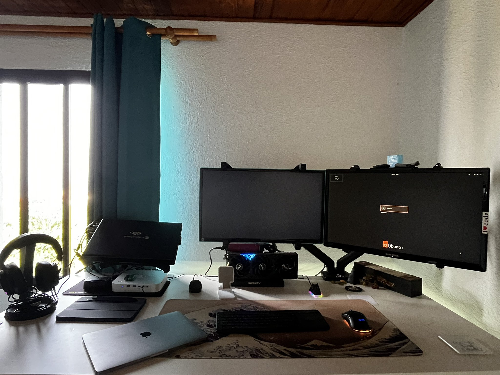
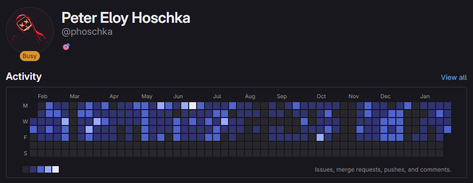

# 👋 Hi there, I'm Peter-Eloy!

  

**Building multi-agent AI systems on custom hardware 🌴**

 _My beast: Emperor - crushing LLMs with OCuLink eGPU_

## 🚀 Featured Projects

  
  
OpenClaw.ai — public multi-agent playground · <a href="https://github.com/Noemi-Paradise/OpenClaw" target="_blank">repo</a>

> 💡 _I maintain **several anonymous GitHub accounts** for experimental work - the real magic happens there!_

## 💼 Professional Work

  
**🟢 For my day job (Go + React), we use private Git repos**  

 
  

## 🛠️ Tech Stack

🤖 AI/ML: Ollama - vLLM - Llama3 - Qwen - DeepSeek - Q4_K_M quantization
🐳 DevOps: Docker - Ubuntu - CUDA 12.x
⚡ Hardware: RTX 5080 - Ryzen AI 9 HX370 - OCuLink - 128GB DDR5
💻 Full-Stack: Python - Bash - JavaScript - PostgreSQL - Supabase
🛠️ Professional: Go - React - Company Git repos (🔒 Private)
🌱 Side Hustle: Hydroponics IoT + AI monitoring (OpenClaw coming soon!)

## 📱 Connect With Me

**🤖 **Best way:** Direct call - DM on WhatsApp!**

**[📝 My CV with a blog →](https://www.petereloy.dev)**  
**[📝 Read my blog on tumblr →](https://www.tumblr.com/blog/peter-eloy)**  
_(Serverless setup - Tumblr hosts it lightning-fast)_

**🐦 Follow on X:** [@petereloy](https://x.com/petereloy) _Latest AI experiments & late-night coding sessions_

## 🔥 Currently Building

- 🔄 **OpenClaw.ai** - Multi-agent LLM orchestration (Noemi + sub-agents)
- 🧪 **Windows → Ubuntu migration** for Emperor AI server
- 🌿 **Hydroponic OpenClaw** - AI-powered grow monitoring
- ⚡ **vLLM + Lemonade Server** multi-model switching

**🦜 Streak Stats**  

---

  
*⚡ Powered by local LLMs • Built on Emperor rig • Optimized for late-night coding*  

